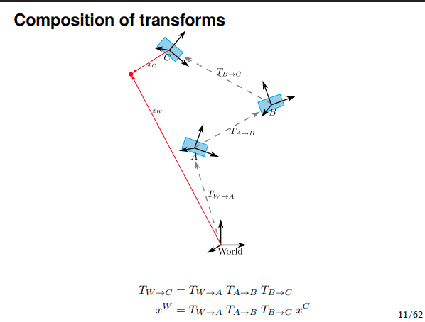

# Introduction to Robot Kinematics

As far as I understand kinematics, its a fundamental concept in robotics that models the movement of a **kinetic chain** (rigid bodies connected by joints). 

One can differentiate between **forward kinematics (FK)** and **inverse kinematics (IK)**:
- **Forward Kinematics (FK)**: Given the robot parameters compute the position and orientation of the **end-effector**.
- **Inverse Kinematics (IK)**: Given a desired position and orientation of the end-effector, compute the necessary joint parameters to achieve that pose.

Some key concepts I found important in kinematics:
---

## 1. Coordinate Frames

A **coordinate frame** is defined by:
- an origin
- axes that allow to uniquely describe positions of points on a manifold (e.g. n-dimensional Euclidean space $\mathbb{R}^n$)

In robotics, we often define multiple coordinate frames:
- **World frame**: fixed to the robot's base
- **Joint frames**: attached to each joint
- **Tool / End-effector frame**: attached to the robot's tool or hand

--- 
## 2. Transformations:

To transform points between coordinate frames, we need to be able to represent:
- **Rotations**: changing the orientation of a frame (e.g. SO(2) for 2D rotations, SO(3) for 3D rotations)
- **Translations**: changing the position of a frame
- **Scaling**: changing the size of objects

We can represent linear transformations by using a matrix operation of the form:
$$
y = Ax
$$
where $x \in \mathbb{R}^n$, $y \in \mathbb{R}^m$, $A \in \mathbb{R}^{m \times n}$ is the transformation matrix.

### 2.1 Homogeneous Transformations

Since in robotics, we are working with rigid bodies, we know that distances between points remain constant.
Therefore, every rigid body transformation is a combination of a rotation and a translation. Which has the form
$$
T(x) = R x + t
$$
where $R$ is a rotation matrix and $t$ is a translation vector.

Rigid transformations have the helpful property that they are invertible, with the inverse given by
$$
T^{-1}_{R, t} = T_{R^T, -R^T t}
$$

### 2.2 Transformation between Frames

Let a point have coordinates $p$ in a frame $F$.The origin of $F$ is at $t$ and its axes are given by $X= (x_1, x_2)$, $Y=(y_1, y_2)$ in 2D.
The coordinates of the point in the world frame are obtained by the rigid transformation
$$
p_W = Rp + t, \quad
R =
\begin{bmatrix}
x_1 & y_1 \\
x_2 & y_2
\end{bmatrix},
$$
where $p_W$ are the coordinates of the point in the world frame. This makes intueitive sense, as we first rotate the point (or frame $F$ axes) into the world frame orientation, and then correct for the translation $t$ of the frame origin.

### 2.3 Homogeneous coordinate representations
To conveniently represent both rotations and translations in a single matrix operation, we use **homogeneous coordinates**. A point $p \in \mathbb{R}^n $ is represented in homogeneous coordinates as $ \tilde{p} \in \mathbb{R}^{n+1} $ by appending an additional coordinate. This coordinate either has the value 1 (for positional quantities) or 0 (for directional quantities). This is done because translations should affect positional quantities (points) but not directional quantities (vectors).

E.g. in 2D:
A rigid transformation  $T(x) = Rx + t$ can be expressed as a single linear transformation in homogeneous coordinates. Defining $\hat{x} = (x_1, x_2, 1)^T$, the transformation becomes
$$
\hat{x}_W = \tilde{T}\hat{x}, \qquad
\tilde{T} =
\begin{bmatrix}
R & t \\
0 & 1
\end{bmatrix}.
$$
This representation allows rotation and translation in a single matrix multiplication.

### 2.4 Composition of Transforms

(source: https://www.user.tu-berlin.de/mtoussai/teaching/14-Robotics/02-kinematics.pdf)
Multiple transformations can be composed by matrix multiplication, but note that different joints have different degrees of freedom. 

---

## 3. Forward Kinematics (FK)

--- 

## 4. Inverse Kinematics (IK)